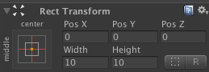
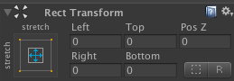

# unity-utils
Different help scripts for Unity engine.

Random Util
======
Unity provides simple Random.Range(min, max) method for int and float numeric types. Real projects need more complex random behavior and number of different advanced methods. Methods from [RandomUtil.cs](//github.com/nubick/unity-utils/blob/master/sources/Assets/Scripts/Utils/RandomUtil.cs) are based on Random.Range and make live a little easier.

Return random bool value.

    bool randomBool = RandomUtil.NextBool();
    
Return random item from item1, item2 or item3 items set.
    
    string randomPerson = RandomUtil.Next("me", "you");
    Pork randomPork = RandomUtil.Next(Pork.NifNif, Pork.NafNaf, Pork.NufNuf);
    
Return random item from array.
    
    int[] intArray = new[] { 1, 3, 5, 7, 9 };
    int randomInt = RandomUtil.NextItem(intArray);
    
Return random item from list.
    
    List<int> list = new List<int> { 1, 3, 5, 7, 9 };
    int randomInt = RandomUtil.NextItem(list);
    
Return random enum item.

    enum Direction { Left, Right, Up, Down }
    Direction randomDirection = RandomUtil.NextEnum<Direction>();
    
Return random index of passed array. Index random selection is based on array weights.

    int[] weights = new int[] { 10, 10, 30, 50 };
    int randomIndex = RandomUtil.NextWeightedInd(weights);
    
Return sub-list of random items from origin list without repeating.

    List<Card> deckCards = GetDeck();
    List<Card> handCards = RandomUtil.Take(deckCards, 6);
    
Shuffle list of items.

    
    List<int> list = new List<int> { 1, 2, 3, 4, 5, 6, 7, 8, 9, 10 };
    RandomUtil.Shuffle(list);
    
Shuffle array of items.

    float[] array = new float[] { 1.1f, 1.2f, 1.3f, 1.5f, 1.6f };
    RandomUtil.Shuffle(array);

Return random point on line.

    Vector2 point1 = new Vector2(123f, 321f);
    Vector2 point2 = new Vector2(0f, 0f);
    Vector2 randomPoint2 = RandomUtil.NextPointOnLine(point1, point2);
    
    Vector3 point3 = new Vector3(123f, 321f, 213f);
    Vector3 point4 = new Vector3(0f, 0f, 0f);
    Vector3 randomPoint3 = RandomUtil.NextPointOnLine(point3, point4);

Get a chance with given percentage (from 0 to 100). If percentage is 25 it will return true each 4th time on an average.

    int percentage = 25;
    bool isSuccess = RandomUtil.GetChance(percentage);

Gets a chance with given probability (from 0f to 1f). If probability is 0.25 it will return true each 4th time on an average.

    float probability = 0.25f;
    bool isSuccess = RandomUtil.GetChance(probability);

Utils Extensions
======
Different extensions sugar-methods for often used operations.

[UtilsExtensions.cs](//github.com/nubick/unity-utils/blob/master/sources/Assets/Scripts/Utils/UtilsExtensions.cs).

Invoke wrappers
------
Type-safe versions of Invoke functions from MonoBehaviour.

Instead using 

    1.  Invoke("InvokedFunc", 1f);
    2.  InvokeRepeating("InvokedFunc", 1f, 1f);
    3.  bool isInvoking = IsInvoking("InvokedFunc");
    4.  CancelInvoke("InvokedFunc");

we can use type-safe methods:

    1.  this.Invoke(() => InvokedFunc(), 1f);
    2.  this.InvokeRepeating(() => InvokedFunc(), 1f, 1f);
    3.  bool isInvoking = this.IsInvoking(() => InvokedFunc());
    4.  this.CancelInvoke(() => InvokedFunc());

RectTransform wrappers
------
RectTransform component contains properties which are not obvious and not easy to use (ex: offsetMin, offsetMax, sizeDelta etc). Unity editor provides more understandable input fields in Inspector for RectTransform like Left, Top, Right, Bottom, Width, Height, PosX, PosY etc.

Sometimes we want to set this fields from code and can't easy understand how to manipulate with RectTransform for that. Following wrappers allow us to do this:

    rectTransform.SetLeft(fLeft);
    rectTransform.SetRight(fRight);
    rectTransform.SetTop(fTop);
    rectTransform.SetBottom(fBottom);
    rectTransform.SetLeftTopRightBottom(fLeft, fTop, fRight, fBottom);
    
    rectTransform.SetPosX(fPosX);
    rectTransform.SetPosY(fPosY);
    rectTransform.SetPosXY(fPosX, fPosY);    
    rectTransform.SetWidth(fWidth);
    rectTransform.SetHeight(fHeight);
    rectTransform.SetWidthHeight(fWidth, fHeight);
    rectTransform.SetPosAndSize(fPosX, fPosY, fWidth, fHeight);

Sometimes we want to use RectTransform Anchors and align UI-components using percentage of parent UI-component sizes. Following wrappers allow us to set offsets in percentage from left, top, right and bottom sides:

    rectTransform.SetLeftAnchorOffset(0.1f);
	rectTransform.SetTopAnchorOffset(0.05f);
    rectTransform.SetRightAnchorOffset(0.05f);
	rectTransform.SetBottomAnchorOffset(0.1f);		
	rectTransform.SetAnchorOffset(0.1f, 0.05f, 0.05f, 0.1f);

RectTransform provides world coordinates of all four RectTransform corners. Method GetWorldCorners returns array of four Vector3 and we always have to read documentation as we can't determinate mapping of this Vector3 points to corners. Following methods wrap this to readable code:

    worldTransform.position = rectTransform.GetWorldCenter();
    worldTransform.position = rectTransform.GetWorldTopLeft();
    worldTransform.position = rectTransform.GetWorldTopRight();
    worldTransform.position = rectTransform.GetWorldBottomLeft();
    worldTransform.position = rectTransform.GetWorldBottomRight();
    worldTransform.position = new Vector2(rectTransform.GetWorldLeft(), rectTransform.GetWorldTop());
    worldTransform.position = new Vector2(rectTransform.GetWorldRight(), rectTransform.GetWorldBottom());
    Rect rect = rectTransform.GetWorldRect();

ParticleSystem.PlayAndWaitForFinish()
------
Wrapper allows to run particle systems sequentially and do logic when concrete particles effect is finished.
        
    public ParticleSystem Particles1;
	public ParticleSystem Particles2;
		
	public IEnumerator RunParticlesCoroutine()
	{
	  yield return Particles1.PlayAndWaitForFinish();
	  yield return Particles2.PlayAndWaitForFinish();
	  DoLogicAfterParticles();
	}

Visual Studio Snippets
======
Install guide
------

1. Download snippets from
[releases](//github.com/nubick/unity-utils/releases).

2. Open Visual Studio Menu -> Tools -> Code Snippets Manager.

3. Add folder with snippets.

Snippets
------
1.Write 'dlog' in VS editor and press 'tab' button. You will get:

    Debug.Log("");

Also, you can use 'dlog1', 'dlog2', 'dlog3', 'dlog4' and 'dlog5' words for Debug.Log with parameters. Check following example:

2.Write 'glh' in VS editor and press 'tab' button. You will get:

    GUILayout.BeginHorizontal();
    
    GUILayout.EndHorizontal();

3.Write 'glv' in VS editor and press 'tab' button. You will get:

    GUILayout.BeginVertical();
    
    GUILayout.EndVertical();
